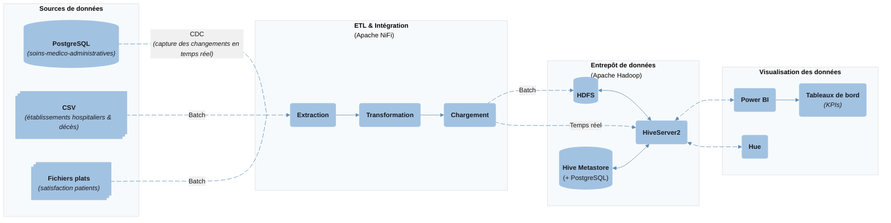

# Architecture

## Choix ETL

Dans le cadre du projet, les sources de données sont variées et combinent des données structurées (bases de données, fichiers CSV) et non structurées (documents, fichiers texte, etc.). Compte tenu des exigences du RGPD et de la sensibilité des données médicales traitées, le choix entre les approches ETL (Extract, Transform, Load) et ELT (Extract, Load, Transform) doit être effectué avec précaution.

L’approche ETL permet de transformer et anonymiser les données avant leur chargement, garantissant ainsi une meilleure sécurité et une conformité réglementaire renforcée. 
L’ELT, plus rapide et évolutive, effectue les transformations directement dans le data Warehouse, mais exige une infrastructure fortement sécurisée, parfois complexe à mettre en place dans un cadre sensible.

Raisons majeures de privilégier ETL (liées au contexte CHU / RGPD)
Minimisation du risque : on ne conserve pas de copies longues durées de données identifiantes en clair (réduction de la « surface d’attaque »).
Pseudonymisation / anonymisation en amont : transformer (masquer, hacher, tokeniser) avant chargement permet d’appliquer des contrôles d’accès stricts et une traçabilité fine. (CNIL insiste sur la différence anonymisation/pseudonymisation et la nécessité de mesures adaptées pour les données de santé).
Conformité d’hébergement : en France les données de santé doivent être hébergées chez un hébergeur certifié HDS ou sur infrastructure interne répondant aux exigences (donc éviter d’envoyer des bruts sur un data-lake public non-certifié).
Auditabilité & preuve de conformité : ETL centralise les règles de transformation et laisse des traces (logs, versions), facilitant DPIA, audits CNIL et démonstration d’encadrement juridique.

Bien qu’une solution hybride combinant ETL et ELT puisse offrir un bon compromis entre performance et sécurité, le projet retient une approche ETL simple. Ce choix se justifie par le temps limité et la volonté de privilégier une solution plus maîtrisable en regroupant tout le processus au même endroit, tout en assurant la protection des données sensibles et la bonne structuration du data Warehouse. 

## Architecture

