# Jobs

&nbsp;&nbsp;&nbsp;&nbsp;&nbsp;Dans le cadre de cette architecture Big Data, un **job** désigne un **flux de traitement automatisé** géré par **Apache NiFi**.
Chaque job correspond à une **étape indépendante du processus ETL**, assurant une fonction spécifique — de la collecte des données à leur intégration dans le data warehouse.

Ces jobs s’exécutent **séquentiellement ou en parallèle** selon la logique du pipeline. Ils sont composés de **processeurs NiFi**, c’est-à-dire des composants configurables réalisant des actions précises (lecture, filtrage, transformation, écriture, etc.), reliés entre eux par des **connexions** qui transportent les *FlowFiles* (les données en transit).

Sur le schéma ci-dessous, chaque bloc représente un **job** NiFi participant à l’ensemble du flux ETL.

L’ensemble de ces jobs forme une chaîne automatisée et traçable qui fiabilise le traitement des données, de leur **collecte initiale** jusqu’à leur **mise à disposition pour l’analyse**.

## Schéma du processus ETL

```mermaid
%%{init: {
  "theme": "base",
  "themeVariables": {
    "background": "transparent",
    "primaryColor": "#A2C2E2",
    "primaryTextColor": "#1a1a1a",
    "primaryBorderColor": "#5B8FB9",
    "lineColor": "#5B8FB9",
    "secondaryColor": "#B9D4E7",
    "tertiaryColor": "#F7FAFC",
    "fontSize": "14px",
    "edgeLabelBackground":"#f0f0f0",
    "nodeBorder": "2px"
  }
}}%%
flowchart LR

  	%% --- STYLE ---
  	classDef empty width:0,height:0;

    %% --- EXTRACT ---
    subgraph EXTRACT ["<b>Extraction</b>"]
        A2["<b>Collecte des données<br>PostgreSQL</b><br/>"]
        A3["<b>Collecte des données<br>Fichiers plats</b><br/>"]
        A4["<b>Collecte des données<br>CSV</b><br/>"]
	end

    %% --- TRANSFORM ---
    subgraph TRANSFORM ["<b>Transformation</b>"]
        B0[ ]:::empty
		B1["<b>Suppression des doublons</b><br/><i>Élimination des enregistrements identiques pour garantir l’unicité</i>"]
        B2["<b>Normalisation</b><br/><i>Uniformisation des formats, unités et conventions</i>"]
        B4["<b>Anonymisation</b><br/><i>Protection des données sensibles via masquage ou suppression</i>"]
        B5["<b>Vérification qualité</b><br/><i>Contrôle de la cohérence, complétude et conformité des données</i>"]
        B6["<b>Enrichissement</b><br/><i>Ajout d’informations complémentaires issues d’autres sources</i>"]
        B7["<b>Agrégation</b><br/><i>Regroupement et calcul d’indicateurs pour l’analyse</i>"]
		B8[ ]:::empty
	end

    %% --- LOAD ---
    subgraph LOAD ["<b>Chargement</b>"]
		direction TB
        C1["<b>Insertion batch</b><br/><i>Regroupe les données transformées et les écrit en fichiers Parquet/ORC dans HDFS</i>"]
        C2["<b>Insertion temps réel</b><br/><i>Injecte directement les données dans Hive via HiveServer2 (JDBC)</i>"]
    end

    %% --- FLUX DE DONNÉES ---
    A2 e1@--- B0
    A3 e2@--- B0
    A4 e3@--- B0
    B0 e4@--> B1 e5@--> B2 e6@--> B4 e7@--> B5 e8@--> B6 e9@--> B7
	B7 e10@--- B8
	B8 e11@--> C1
	B8 e12@--> C2

	%% --- ANIMATIONS ---
	e1@{ animation: slow }
	e2@{ animation: slow }
	e3@{ animation: slow }
	e4@{ animation: slow }
	e5@{ animation: slow }
	e6@{ animation: slow }
	e7@{ animation: slow }
	e8@{ animation: slow }
	e9@{ animation: slow }
	e10@{ animation: slow }
	e11@{ animation: slow }
	e12@{ animation: slow }
```

