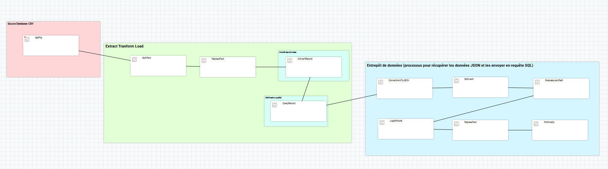
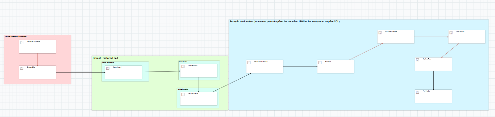

# Livrable 2 

## Script de création des tables

Les fichiers `scripts/create_dimensions.sql` et `scripts/create_faits.sql` contiennent les scripts SQL pour la création des tables de dimensions et de faits respectivement (avec partitionnement et bucketing). Des jobs NiFi ont été utilisés pour automatiser le processus de création des tables.

## Jobs NiFi pour le peuplement des tables

Les captures d'écran suivantes montrent les jobs Apache NiFi créés pour le peuplement des tables de l'entrepôt de données. Les jobs ont été exportés au format JSON et sont disponibles dans le dossier `jobs/`.

### Job fait_consultation_detailed
*Version détaillée des processors*

### Job fait_deces

### Job fait_hospitalisation

### Job fait_satisfaction

### Job dim_diagnostic

### Job dim_etablissement

### Job dim_localisation

### Job dim_patient

### Job dim_professionnel_sante

### Job dim_specialite

## Vérification des données

L'interface Hue a été utilisée pour vérifier les données présentes dans les tables de l'entrepôt de données.

## Évaluation de la performance

Les rêquêtes SQL utilisées pour évaluer la performance d'accès à l'entrepôt de données sont disponibles dans le fichier `scripts/hive_query_perf.sql`. Voici un graphe illustrant les temps de réponses obtenus lors de l'exécution de ces requêtes :

