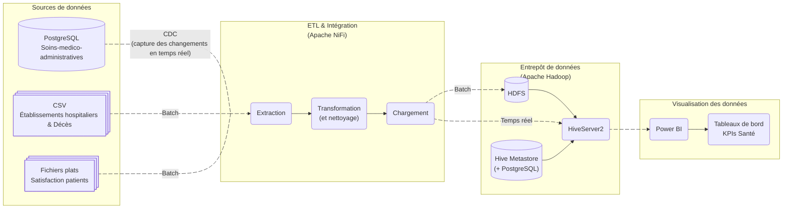
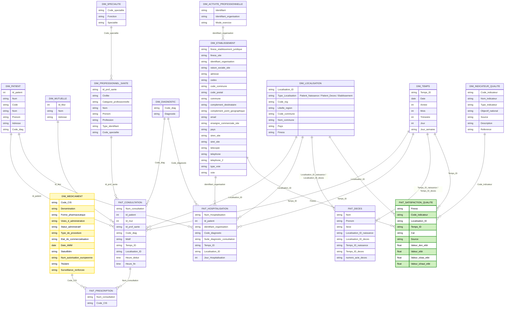

# CESI BigData

## Architecture

```mermaid
flowchart LR

  %% Style
  classDef empty width:0,height:0;

  %% Sources de données brutes
  subgraph Sources["Sources de données"]
    A1[("PostgreSQL<br>Soins-medico-administratives")]
    A2@{ shape: processes, label: "CSV<br>Établissements hospitaliers & Décès"}
    A3@{ shape: processes, label: "Fichiers plats<br>Satisfaction patients"}
  end
  
  %% Ingestion/Intégration
  subgraph ETL["ETL & Intégration<br>(Apache NiFi)"]
    N0[ ]:::empty
    N1("Extraction")
    N2("Transformation<br>(et nettoyage)")
    N3("Chargement")
  end
  
  %% Stockage / Data Warehouse
  subgraph Hadoop["Entrepôt de données<br>(Apache Hadoop)"]
    H1[("HDFS")]
    H2[("Hive Metastore<br>(+ PostgreSQL)")]
    H3("HiveServer2")
    %%H4[(Hue - Interface Web)]
  end
  
  %% Analyse / Visualisation
  subgraph BI["Visualisation des données "]
    B1(Power BI)
    B2(Tableaux de bord<br>KPIs Santé)
  end
  
  %% Relations
  A1 e1@--- |"CDC<br>(capture des changements en temps réel)"| N0
  A2 e2@--- |"Batch"| N0
  A3 e3@--- |"Batch"| N0
  N0 e4@--> N1 --> N2 --> N3 e5@--> |"Batch"| H1 --> H3
  N3 e6@--> |"Temps réel"| H3
  H3 e7@--> B1 --> B2
  H2 --> H3
  %%H4 --> H3

  %% Animations
  e1@{ animation: slow }
  e2@{ animation: slow }
  e3@{ animation: slow }
  e4@{ animation: slow }
  e5@{ animation: slow }
  e6@{ animation: slow }
  e7@{ animation: slow }
```

## Modèle de données 

```mermaid
erDiagram
	direction TB

	DIM_PATIENT {
		int Id_patient
		string Num
		string Code
		string Nom
		string Prenom
		string Adresse
		string Code_diag
	}

	DIM_MUTUELLE {
		int Id_Mut
		string Nom
		string Adresse
	}

	DIM_PROFESSIONNEL_SANTE {
		string Id_prof_sante
		string Civilite
		string Categorie_professionnelle
		string Nom
		string Prenom
		string Profession
		string Type_identifiant
		string Code_specialite
	}

	DIM_ACTIVITE_PROFESSIONNELLE {
		string Identifiant
		string Identifiant_organisation
		string Mode_exercice
	}

	DIM_SPECIALITE {
		string Code_specialite
		string Fonction
		string Specialite
	}

	DIM_DIAGNOSTIC {
		string Code_diag
		string Diagnostic
	}

	DIM_MEDICAMENT {
		string Code_CIS
		string Denomination
		string Forme_pharmaceutique
		string Voies_d_administration
		string Statut_administratif
		string Type_de_procedure
		string Etat_de_commercialisation
		date Date_AMM
		string StatutBdm
		string Num_autorisation_europeenne
		string Titulaire
		string Surveillance_renforcee
	}

	DIM_ETABLISSEMENT {
		string finess_etablissement_juridique
		string finess_site
		string identifiant_organisation
		string raison_sociale_site
		string adresse
		string cedex
		string code_commune
		string code_postal
		string commune
		string complement_destinataire
		string complement_point_geographique
		string email
		string enseigne_commerciale_site
		string pays
		string siren_site
		string siret_site
		string telecopie
		string telephone
		string telephone_2
		string type_voie
		string voie
	}

	DIM_LOCALISATION {
		string Localisation_ID
		string Type_Localisation "Patient_Naissance / Patient_Deces / Etablissement"
		string Code_reg
		string Libelle_region
		string Code_commune
		string Nom_commune
		string Pays
		string Finess
	}

	DIM_TEMPS {
		string Temps_ID
		date Date
		int Annee
		int Mois
		int Trimestre
		int Jour
		string Jour_semaine
	}

	FAIT_CONSULTATION {
		string Num_consultation
		int Id_patient
		int Id_mut
		string Id_prof_sante
		string Code_diag
		string Motif
		string Temps_ID
		string Localisation_ID
		time Heure_debut
		time Heure_fin
	}

	FAIT_PRESCRIPTION {
		string Num_consultation
		string Code_CIS
	}

	FAIT_HOSPITALISATION {
		string Num_Hospitalisation
		int Id_patient
		string identifiant_organisation
		string Code_diagnostic
		string Suite_diagnostic_consultation
		string Temps_ID
		string Localisation_ID
		int Jour_Hospitalisation
	}

	FAIT_DECES {
		string Nom
		string Prenom
		string Sexe
		string Localisation_ID_naissance
		string Localisation_ID_deces
		string Temps_ID_naissance
		string Temps_ID_deces
		string numero_acte_deces
	}

	DIM_INDICATEUR_QUALITE {
		string Code_indicateur
		string Nom_indicateur
		string Type_indicateur
		string Objectif_national
		string Source
		string Description
		string Reference
	}

	FAIT_SATISFACTION_QUALITE {
		string Finess
		string Code_indicateur
		string Localisation_ID
		string Temps_ID
		string Cat
		string Source
		float Valeur_den_etbt
		float Valeur_etbt
		float Valeur_icbas_etbt
		float Valeur_ichaut_etbt
	}

	%% RELATIONS
	DIM_PATIENT||--o{FAIT_CONSULTATION:"Id_patient"
	DIM_MUTUELLE||--o{FAIT_CONSULTATION:"Id_Mut"
	DIM_PROFESSIONNEL_SANTE||--o{FAIT_CONSULTATION:"Id_prof_sante"
	DIM_DIAGNOSTIC||--o{FAIT_CONSULTATION:"Code_diag"
	DIM_TEMPS||--o{FAIT_CONSULTATION:"Temps_ID"
	DIM_LOCALISATION||--o{FAIT_CONSULTATION:"Localisation_ID"

	FAIT_CONSULTATION||--o{FAIT_PRESCRIPTION:"Num_consultation"
	DIM_MEDICAMENT||--o{FAIT_PRESCRIPTION:"Code_CIS"

	DIM_PATIENT||--o{FAIT_HOSPITALISATION:"Id_patient"
	DIM_ETABLISSEMENT||--o{FAIT_HOSPITALISATION:"identifiant_organisation"
	DIM_DIAGNOSTIC||--o{FAIT_HOSPITALISATION:"Code_diagnostic"
	DIM_TEMPS||--o{FAIT_HOSPITALISATION:"Temps_ID"
	DIM_LOCALISATION||--o{FAIT_HOSPITALISATION:"Localisation_ID"

	DIM_LOCALISATION||--o{FAIT_DECES:"Localisation_ID_naissance / Localisation_ID_deces"
	DIM_TEMPS||--o{FAIT_DECES:"Temps_ID_naissance / Temps_ID_deces"

	DIM_SPECIALITE||--o{DIM_PROFESSIONNEL_SANTE:"Code_specialite"
	DIM_ACTIVITE_PROFESSIONNELLE||--o{DIM_ETABLISSEMENT:"identifiant_organisation"

	DIM_ETABLISSEMENT||--o{FAIT_SATISFACTION_QUALITE:"Finess"
	DIM_INDICATEUR_QUALITE||--o{FAIT_SATISFACTION_QUALITE:"Code_indicateur"
	DIM_LOCALISATION||--o{FAIT_SATISFACTION_QUALITE:"Localisation_ID"
	DIM_TEMPS||--o{FAIT_SATISFACTION_QUALITE:"Temps_ID"

	style DIM_MEDICAMENT fill:#FFF9C4,stroke:#FFD600,color:#000000
	style FAIT_SATISFACTION_QUALITE fill:#D0F0C0,stroke:#228B22,color:#000000
```

## Jobs

