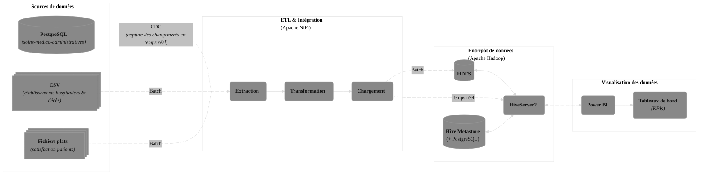
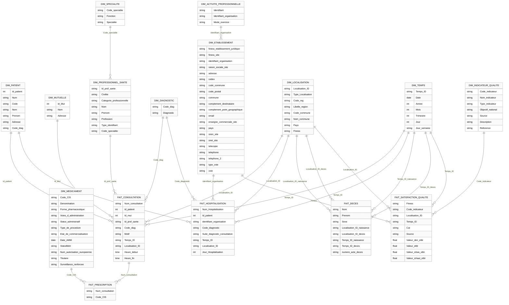
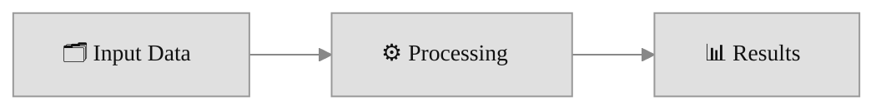

# CESI BigData

&nbsp;&nbsp;&nbsp;&nbsp;Dans un contexte de transformation numérique du secteur de la santé, le groupe Cloud Healthcare Unit (CHU) souhaite mettre en place un entrepôt de données sécurisé pour exploiter, analyser et valoriser les données médicales issues de ses différents systèmes tout en garantissant la conformité au RGPD et la protection des données sensibles des patients.

## Architecture

## Modèle de données 

## Jobs

```mermaid
flowchart LR

  	%% --- STYLE ---
  	classDef empty width:0,height:0;

    %% --- EXTRACT ---
    subgraph EXTRACT ["<b>Extraction</b>"]
        A2["<b>Collecte des données<br>PostgreSQL</b><br/>"]
        A3["<b>Collecte des données<br>Fichiers plats</b><br/>"]
        A4["<b>Collecte des données<br>CSV</b><br/>"]
	end

    %% --- TRANSFORM ---
    subgraph TRANSFORM ["<b>Transformation</b>"]
        B0[ ]:::empty
		B1["<b>Suppression des doublons</b><br/><i>Élimination des enregistrements identiques pour garantir l’unicité</i>"]
        B2["<b>Normalisation</b><br/><i>Uniformisation des formats, unités et conventions</i>"]
        B4["<b>Anonymisation</b><br/><i>Protection des données sensibles via masquage ou suppression</i>"]
        B5["<b>Vérification qualité</b><br/><i>Contrôle de la cohérence, complétude et conformité des données</i>"]
        B6["<b>Enrichissement</b><br/><i>Ajout d’informations complémentaires issues d’autres sources</i>"]
        B7["<b>Agrégation</b><br/><i>Regroupement et calcul d’indicateurs pour l’analyse</i>"]
		B8[ ]:::empty
	end

    %% --- LOAD ---
    subgraph LOAD ["<b>Chargement</b>"]
		direction TB
        C1["<b>Insertion batch</b><br/><i>Regroupe les données transformées et les écrit en fichiers Parquet/ORC dans HDFS</i>"]
        C2["<b>Insertion temps réel</b><br/><i>Injecte directement les données dans Hive via HiveServer2 (JDBC)</i>"]
    end

    %% --- FLUX DE DONNÉES ---
    A2 e1@--- B0
    A3 e2@--- B0
    A4 e3@--- B0
    B0 e4@--> B1 e5@--> B2 e6@--> B4 e7@--> B5 e8@--> B6 e9@--> B7
	B7 e10@--- B8
	B8 e11@--> C1
	B8 e12@--> C2

	%% --- ANIMATIONS ---
	e1@{ animation: slow }
	e2@{ animation: slow }
	e3@{ animation: slow }
	e4@{ animation: slow }
	e5@{ animation: slow }
	e6@{ animation: slow }
	e7@{ animation: slow }
	e8@{ animation: slow }
	e9@{ animation: slow }
	e10@{ animation: slow }
	e11@{ animation: slow }
	e12@{ animation: slow }
```

