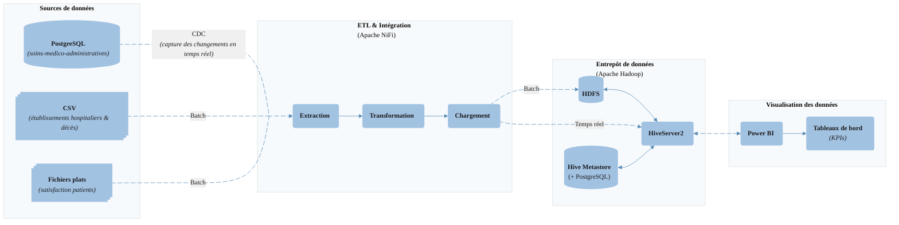

# CESI BigData

&nbsp;&nbsp;&nbsp;&nbsp;Dans un contexte de transformation numérique du secteur de la santé, le groupe Cloud Healthcare Unit (CHU) souhaite mettre en place un entrepôt de données sécurisé pour exploiter, analyser et valoriser les données médicales issues de ses différents systèmes tout en garantissant la conformité au RGPD et la protection des données sensibles des patients.


## Architecture


```mermaid
%%{init: {
  "theme": "base",
  "themeVariables": {
    "background": "transparent",
    "primaryColor": "#A2C2E2",
    "primaryTextColor": "#1a1a1a",
    "primaryBorderColor": "#5B8FB9",
    "lineColor": "#5B8FB9",
    "secondaryColor": "#B9D4E7",
    "tertiaryColor": "#F7FAFC",
    "fontFamily": "Inter, Segoe UI, sans-serif",
    "fontSize": "14px",
    "edgeLabelBackground":"#f0f0f0",
    "nodeBorder": "2px"
  }
}}%%
flowchart LR

  %% Style
  classDef empty width:0,height:0;

  %% Sources de données brutes
  subgraph Sources["<b>Sources de données</b>"]
    A1[("<b>PostgreSQL</b><br><i>(soins-medico-administratives)</i>")]
    A2@{ shape: processes, label: "<b>CSV</b><br><i>(établissements hospitaliers & décès)</i>"}
    A3@{ shape: processes, label: "<b>Fichiers plats</b><br><i>(satisfaction patients)</i>"}
  end
  
  %% Ingestion/Intégration
  subgraph ETL["<b>ETL & Intégration</b><br>(Apache NiFi)"]
    N0[ ]:::empty
    N1("<b>Extraction</b>")
    N2("<b>Transformation</b>")
    N3("<b>Chargement</b>")
  end
  
  %% Stockage / Data Warehouse
  subgraph Hadoop["<b>Entrepôt de données</b><br>(Apache Hadoop)"]
    H1[("<b>HDFS</b>")]
    H2[("<b>Hive Metastore</b><br>(+ PostgreSQL)")]
    H3("<b>HiveServer2</b>")
    %%H4[(Hue - Interface Web)]
  end
  
  %% Analyse / Visualisation
  subgraph BI["<b>Visualisation des données</b>"]
    B1("<b>Power BI</b>")
    B2("<b>Tableaux de bord</b><br><i>(KPIs)</i>")
  end
  
  %% Relations
  A1 e1@--- |"CDC<br><i>(capture des changements en temps réel)</i>"| N0
  A2 e2@--- |"Batch"| N0
  A3 e3@--- |"Batch"| N0
  N0 e4@--> N1 --> N2 --> N3 e5@--> |"Batch"| H1 <--> H3
  N3 e6@--> |"Temps réel"| H3
  H3 e7@<--> B1 --> B2
  H2 <--> H3
  %%H4 --> H3

  %% Animations
  e1@{ animation: slow }
  e2@{ animation: slow }
  e3@{ animation: slow }
  e4@{ animation: slow }
  e5@{ animation: slow }
  e6@{ animation: slow }
  e7@{ animation: slow }
```


## Modèle de données 


```mermaid
%%{init: {
  "theme": "base",
  "themeVariables": {
    "background": "transparent",
    "primaryColor": "#A2C2E2",
    "primaryTextColor": "#1a1a1a",
    "primaryBorderColor": "#5B8FB9",
    "lineColor": "#5B8FB9",
    "secondaryColor": "#B9D4E7",
    "tertiaryColor": "#F7FAFC",
    "fontFamily": "Inter, Segoe UI, sans-serif",
    "fontSize": "14px",
    "edgeLabelBackground":"#f0f0f0",
    "nodeBorder": "2px"
  }
}}%%
erDiagram
	direction TB

	%% === DIMENSIONS ===

	DIM_PATIENT {
		int Id_patient
		string Anom_Sexe
		int Age
	}

	DIM_PROFESSIONNEL_SANTE {
		string Id_prof_sante
		string Anom_Nom
		string Anom_Prenom
		string Categorie_professionnelle
		string Code_specialite
	}

	DIM_DIAGNOSTIC {
		string Code_diag
		string Diagnostic
	}

	DIM_ETABLISSEMENT {
		string identifiant_organisation
		string Nom_etablissement
		string Code_region
		string Region
	}

	DIM_LOCALISATION {
		string Localisation_ID
		string Code_reg
		string Libelle_region
		string Code_commune
		string Nom_commune
		string Pays
	}

	DIM_TEMPS {
		string Temps_ID
		date Date
		int Annee
		int Mois
		int Trimestre
	}

	DIM_INDICATEUR_QUALITE {
		string Code_indicateur
		string Nom_indicateur
		string Type_indicateur
	}

	%% === FAITS ===

	FAIT_CONSULTATION {
		string Num_consultation
		int Id_patient
		string Id_prof_sante
		string Code_diag
		string identifiant_organisation
		string Temps_ID
		string Localisation_ID
	}

	FAIT_HOSPITALISATION {
		string Num_Hospitalisation
		int Id_patient
		string identifiant_organisation
		string Code_diag
		string Temps_ID
		string Localisation_ID
	}

	FAIT_DECES {
		string Anom_Sexe
		string Localisation_ID_deces
		string Temps_ID_deces
	}

	FAIT_SATISFACTION_QUALITE {
		string identifiant_organisation
		string Code_indicateur
		string Localisation_ID
		string Temps_ID
		float Valeur
	}

	%% === RELATIONS ===

	DIM_PATIENT||--o{FAIT_CONSULTATION:"Id_patient"
	DIM_PROFESSIONNEL_SANTE||--o{FAIT_CONSULTATION:"Id_prof_sante"
	DIM_DIAGNOSTIC||--o{FAIT_CONSULTATION:"Code_diag"
	DIM_ETABLISSEMENT||--o{FAIT_CONSULTATION:"identifiant_organisation"
	DIM_TEMPS||--o{FAIT_CONSULTATION:"Temps_ID"
	DIM_LOCALISATION||--o{FAIT_CONSULTATION:"Localisation_ID"

	DIM_PATIENT||--o{FAIT_HOSPITALISATION:"Id_patient"
	DIM_DIAGNOSTIC||--o{FAIT_HOSPITALISATION:"Code_diag"
	DIM_ETABLISSEMENT||--o{FAIT_HOSPITALISATION:"identifiant_organisation"
	DIM_TEMPS||--o{FAIT_HOSPITALISATION:"Temps_ID"
	DIM_LOCALISATION||--o{FAIT_HOSPITALISATION:"Localisation_ID"

	DIM_LOCALISATION||--o{FAIT_DECES:"Localisation_ID_deces"
	DIM_TEMPS||--o{FAIT_DECES:"Temps_ID_deces"

	DIM_ETABLISSEMENT||--o{FAIT_SATISFACTION_QUALITE:"identifiant_organisation"
	DIM_INDICATEUR_QUALITE||--o{FAIT_SATISFACTION_QUALITE:"Code_indicateur"
	DIM_LOCALISATION||--o{FAIT_SATISFACTION_QUALITE:"Localisation_ID"
	DIM_TEMPS||--o{FAIT_SATISFACTION_QUALITE:"Temps_ID"

	style FAIT_SATISFACTION_QUALITE fill:#D0F0C0,stroke:#228B22,color:#000000
	style FAIT_CONSULTATION fill:#CFE2FF,stroke:#0044CC,color:#000000
	style FAIT_HOSPITALISATION fill:#FFF4CC,stroke:#FFCC00,color:#000000
	style FAIT_DECES fill:#FADADD,stroke:#D61A46,color:#000000
```


## Jobs


```mermaid
%%{init: {
  "theme": "base",
  "themeVariables": {
    "background": "transparent",
    "primaryColor": "#A2C2E2",
    "primaryTextColor": "#1a1a1a",
    "primaryBorderColor": "#5B8FB9",
    "lineColor": "#5B8FB9",
    "secondaryColor": "#B9D4E7",
    "tertiaryColor": "#F7FAFC",
    "fontFamily": "Inter, Segoe UI, sans-serif",
    "fontSize": "14px",
    "edgeLabelBackground":"#f0f0f0",
    "nodeBorder": "2px"
  }
}}%%
flowchart LR

  	%% --- STYLE ---
  	classDef empty width:0,height:0;

    %% --- EXTRACT ---
    subgraph EXTRACT ["<b>Extraction</b>"]
        A2["<b>Collecte des données<br>PostgreSQL</b><br/>"]
        A3["<b>Collecte des données<br>Fichiers plats</b><br/>"]
        A4["<b>Collecte des données<br>CSV</b><br/>"]
	end

    %% --- TRANSFORM ---
    subgraph TRANSFORM ["<b>Transformation</b>"]
        B0[ ]:::empty
		B1["<b>Suppression des doublons</b><br/><i>Élimination des enregistrements identiques pour garantir l’unicité</i>"]
        B2["<b>Normalisation</b><br/><i>Uniformisation des formats, unités et conventions</i>"]
        B4["<b>Anonymisation</b><br/><i>Protection des données sensibles via masquage ou suppression</i>"]
        B5["<b>Vérification qualité</b><br/><i>Contrôle de la cohérence, complétude et conformité des données</i>"]
        B6["<b>Enrichissement</b><br/><i>Ajout d’informations complémentaires issues d’autres sources</i>"]
        B7["<b>Agrégation</b><br/><i>Regroupement et calcul d’indicateurs pour l’analyse</i>"]
		B8[ ]:::empty
	end

    %% --- LOAD ---
    subgraph LOAD ["<b>Chargement</b>"]
		direction TB
        C1["<b>Insertion batch</b><br/><i>Regroupe les données transformées et les écrit en fichiers Parquet/ORC dans HDFS</i>"]
        C2["<b>Insertion temps réel</b><br/><i>Injecte directement les données dans Hive via HiveServer2 (JDBC)</i>"]
    end

    %% --- FLUX DE DONNÉES ---
    A2 e1@--- B0
    A3 e2@--- B0
    A4 e3@--- B0
    B0 e4@--> B1 e5@--> B2 e6@--> B4 e7@--> B5 e8@--> B6 e9@--> B7
	B7 e10@--- B8
	B8 e11@--> C1
	B8 e12@--> C2

	%% --- ANIMATIONS ---
	e1@{ animation: slow }
	e2@{ animation: slow }
	e3@{ animation: slow }
	e4@{ animation: slow }
	e5@{ animation: slow }
	e6@{ animation: slow }
	e7@{ animation: slow }
	e8@{ animation: slow }
	e9@{ animation: slow }
	e10@{ animation: slow }
	e11@{ animation: slow }
	e12@{ animation: slow }
```

}}%%
flowchart LR
    A["🗂️ Input Data"] --> B["⚙️ Processing"]
    B --> C["📊 Results"]
```
